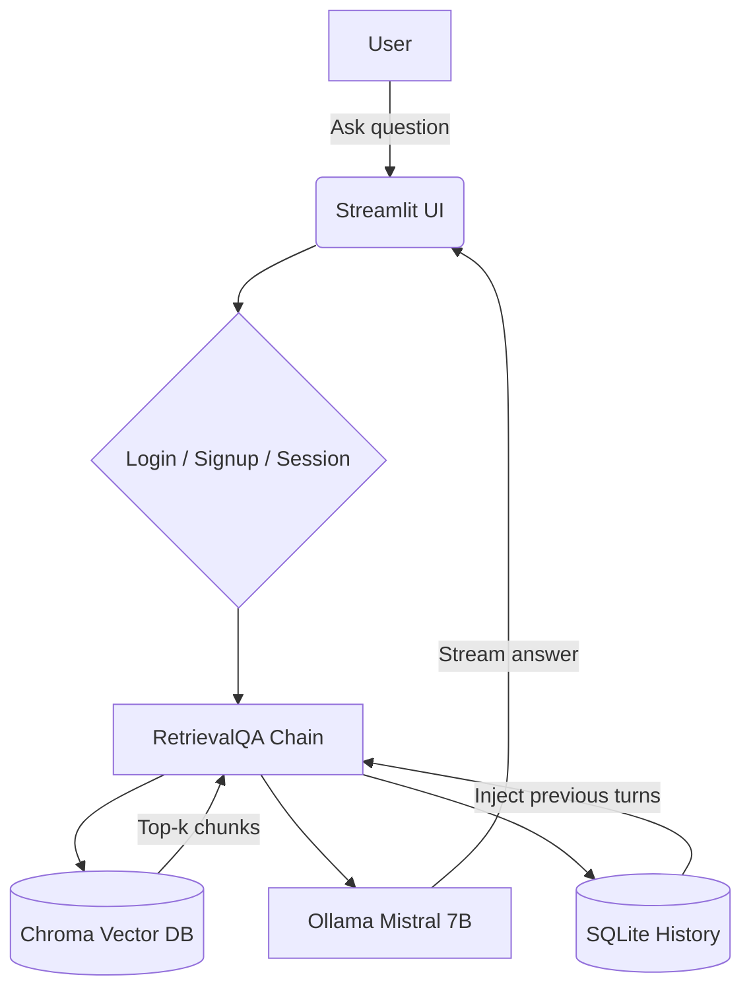

# 🧠 CodeSarthi – AI Codebase Assistant

[](https://www.python.org/downloads/)
[](https://python.langchain.com/)
[](https://streamlit.io/)
[](https://ollama.com/)
[](https://opensource.org/licenses/MIT)

**A private, local, and intelligent assistant for your codebase.**  
Ask natural language questions about your code, documentation, and PDFs – and get accurate, context‑aware answers with conversation memory.

---

## ✨ What is CodeSarthi?

CodeSarthi is an AI‑powered tool that ingests your entire code repository – including source files, READMEs, markdown docs, and PDFs – and lets you query it in plain English.  
It uses a local Large Language Model (**Mistral 7B via Ollama**) for complete privacy, **no cloud API costs**, and runs entirely on your machine.

Whether you're a new developer trying to understand a large project, or a senior dev who needs quick answers without digging through files, CodeSarthi is your instant code companion.

---

## 🚀 Key Features

- 🔐 **Multi‑user signup & login** – Isolated conversations per user (SQLite authentication)
- 📚 **Full codebase ingestion** – Supports `.py`, `.md`, `.pdf`, and more (extensible)
- 🧠 **Semantic search** – Uses embeddings and a vector database (Chroma) to find the most relevant code/documentation chunks
- 💬 **Conversational memory** – Remembers the context of your conversation across multiple turns
- ⚡ **Streaming responses** – Real‑time word‑by‑word output, just like ChatGPT
- 🔍 **Observability** – Optional integration with LangSmith to trace every step
- 🛡️ **100% local** – Your code never leaves your machine; no internet required after setup

---

## 🧱 How It Works



1. **Ingestion (one‑time):** All files in `repo/` and `pdf_file/` are split into chunks, embedded with Ollama, and stored in a local Chroma database.
2. **Query:** Your question is embedded and used to find the most relevant chunks via similarity search.
3. **Augmentation:** Those chunks are injected into a prompt together with the conversation history.
4. **Generation:** The LLM (Mistral 7B) streams the answer back to the UI.
5. **Memory:** Every exchange is saved to SQLite and reused in future interactions.

---

## 🛠️ Tech Stack

| Tool | Purpose |
|------|---------|
| **LangChain** | Orchestration, RAG, memory, and chains |
| **Ollama + Mistral 7B** | Local LLM inference and embeddings |
| **ChromaDB** | Vector database for similarity search |
| **Streamlit** | Interactive web UI |
| **SQLite** | User accounts and chat history persistence |
| **PyPDF / Unstructured** | Document parsing (PDF, markdown, etc.) |
| **LangSmith** | Optional observability and tracing |

---

## 📋 Prerequisites

Before you begin, make sure you have:

- Python 3.10 or higher
- [Ollama](https://ollama.com/) installed and running in the background
- Git (optional, for cloning)

---

## 🔧 Installation & Setup

### 1. Clone the repository
```bash
git clone https://github.com/your-username/codesarthi.git
cd codesarthi
```

### 2. Create a virtual environment
```bash
python -m venv venv
source venv/bin/activate      # On Linux/Mac
venv\Scripts\activate         # On Windows
```

### 3. Install dependencies
```bash
pip install -r requirements.txt
```

> The `requirements.txt` includes: `langchain`, `langchain-community`, `langchain-chroma`, `langchain-ollama`, `python-dotenv`, `streamlit`, `pypdf`, `unstructured`, `chromadb`.

### 4. Pull the local LLM
Make sure Ollama is running (`ollama serve` in another terminal). Then:
```bash
ollama pull mistral:7b
```

### 5. (Optional) Set up LangSmith tracing
Create a `.env` file in the project root:
```
LANGCHAIN_TRACING_V2=true
LANGCHAIN_ENDPOINT=https://api.smith.langchain.com
LANGCHAIN_API_KEY=ls__your_key_here
LANGCHAIN_PROJECT=codesarthi
```
You can skip this – the app will still work without it.

### 6. Prepare your codebase
Place your source files and READMEs in the `repo/` folder, and PDF documents in the `pdf_file/` folder.  
The sample project already contains a few files for testing, including `mysql_cheatsheet.pdf`.

### 7. Ingest the data
This step creates the vector database (takes a few minutes on first run):
```bash
python ingest.py
```
You should see messages like `Loaded X pages`, `Created Y chunks`, `Vector store created`.

> ⚠️ If you add new files to `repo/` or `pdf_file/`, delete the `chroma_code/` folder and re-run `ingest.py` to rebuild the vector store.

### 8. Run the assistant
```bash
streamlit run app.py
```
Open your browser at http://localhost:8501.

---

## 🧪 Sample Queries

Once the app is running, try questions like:

**From codebase (`repo/`):**
- "How does the authentication flow work?"
- "What is the purpose of `user_service.py`?"
- "Explain the password hashing function."
- "What does the function `hash_password` do?"
- "What files are in the repo and what do they do?"

**From PDF (`pdf_file/mysql_cheatsheet.pdf`):**
- "What is the syntax for a SELECT statement in MySQL?"
- "How do I use JOIN in MySQL?"
- "What are the different types of MySQL data types?"
- "How do I create a table in MySQL?"
- "Explain GROUP BY and HAVING in MySQL."

The assistant will answer using content from both your repository and the PDF documents.

---

## 📁 Project Structure

```
codesarthi/
├── .env                  ← LangSmith keys (optional, gitignored)
├── .gitignore
├── requirements.txt
├── README.md
├── auth_db.py            ← User signup, login, password hashing
├── ingest.py             ← One-time data ingestion script
├── app.py                ← Main Streamlit app
├── repo/                 ← Your codebase goes here
│   ├── README.md
│   ├── auth.py
│   └── user_service.py
├── pdf_file/             ← PDF documents go here
│   └── mysql_cheatsheet.pdf
├── chroma_code/          ← Auto-generated vector DB (gitignored)
├── users.db              ← Auto-generated user accounts DB (gitignored)
└── code_history.db       ← Auto-generated chat history DB (gitignored)
```

### 🗂️ File & Folder Breakdown

**`.env`**  
Yahan tumhare secret keys aur environment variables store hote hain – jaise LangSmith API key, tracing endpoint, aur project name. Ye file kabhi bhi GitHub pe push nahi karni chahiye. Agar LangSmith use nahi karna, toh ye file optional hai – app bina iske bhi chalega.

**`.gitignore`**  
Ye file Git ko batati hai ki kaunse folders aur files ko ignore karna hai jab tum code push karo. Isme `venv/`, `chroma_code/`, `.env`, `users.db`, `code_history.db`, aur `__pycache__/` listed hote hain – kyunki ye sab ya toh sensitive hain ya locally generate hote hain, inhe repo mein nahi rakhna chahiye.

**`requirements.txt`**  
Is file mein saare Python packages listed hain jo is project ko chalane ke liye chahiye – `langchain`, `langchain-community`, `langchain-chroma`, `langchain-ollama`, `chromadb`, `streamlit`, `pypdf`, `unstructured`, `python-dotenv`. Koi bhi naya developer sirf `pip install -r requirements.txt` run karke poora environment set up kar sakta hai.

**`README.md`**  
Ye wahi file hai jo tum abhi padh rahe ho. Isme project ka overview, setup steps, sample queries, aur project structure explain kiya gaya hai. Ye kisi bhi naye developer ke liye pehla stop hona chahiye.

**`auth_db.py`**  
Is file mein user authentication ka poora logic hai. Ye SQLite database use karke users ke accounts manage karta hai – signup, login, aur password hashing sab yahan hota hai. Passwords plain text mein store nahi hote – `hashlib.sha256` se hash karke store hote hain. Har user ka ek alag session hota hai taaki conversations mix na hon.

**`ingest.py`**  
Ye sabse pehle run karne wali file hai – ek baar setup ke time. Ye `repo/` aur `pdf_file/` folders ke saare files ko load karta hai, unhe chhote-chhote chunks mein todta hai (`chunk_size=1500`, `chunk_overlap=200`), har chunk ka embedding banata hai (Ollama `mistral:7b` se), aur sab kuch Chroma vector database mein save kar deta hai. Jab tak ye nahi chalega, assistant ke paas koi knowledge nahi hogi.

**`app.py`**  
Ye main Streamlit application file hai jo browser mein UI render karti hai. Isme signup/login tabs, chat interface, streaming responses, aur "New Thread" reset button sab kuch hai. Ye `auth_db.py` se user verify karta hai, Chroma DB se relevant chunks retrieve karta hai, aur `RunnableWithMessageHistory` se conversation memory maintain karta hai.

---

**`repo/` folder**  
Yahan tumhara actual codebase jaata hai – jo bhi files tum assistant ko samjhana chahte ho. By default kuch sample files hain:

- **`repo/README.md`** – Sample project ka overview document. Assistant isse padh ke project ke baare mein high-level questions answer kar sakta hai.
- **`repo/auth.py`** – Ek sample authentication module jisme login, logout, aur token validation ka code hai. Assistant isse padh ke "How does login work?" jaisi queries handle karta hai.
- **`repo/user_service.py`** – Ek sample service file jisme user creation, fetching, aur password hashing ka logic hai. Assistant isse use karke user-related questions answer karta hai.

> 💡 Tum apni khud ki files yahan rakh sakte ho – `.py`, `.md`, ya koi bhi text-based file. `chroma_code/` delete karo, `ingest.py` dobara run karo – assistant tumhari nayi files bhi samjhega.

---

**`pdf_file/` folder**  
Yahan PDF documents rakh sakte ho – jaise cheatsheets, architecture docs, onboarding guides, ya koi bhi reference material.

- **`pdf_file/mysql_cheatsheet.pdf`** – MySQL commands aur syntax ka quick reference guide. Assistant isse padh ke MySQL-related questions answer karta hai – jaise SELECT queries, JOINs, data types, indexes, aur stored procedures.

> 💡 Koi bhi PDF yahan daalo, `chroma_code/` delete karo, `ingest.py` run karo – assistant usse bhi padh lega.

---

**`chroma_code/` folder** *(auto-generated, gitignored)*  
Ye folder `ingest.py` run karne ke baad automatically banta hai. Isme saare document chunks ke vector embeddings stored hote hain. Ye tumhara local vector database hai – isko manually edit mat karo. Agar dobara ingest karna ho toh pehle is folder ko delete karo, phir `ingest.py` run karo.

**`users.db`** *(auto-generated, gitignored)*  
Ye SQLite database file app pehli baar run hone par automatically banti hai. Isme registered users ke credentials (hashed passwords) store hote hain. Har user ka account alag hota hai.

**`code_history.db`** *(auto-generated, gitignored)*  
Ye SQLite database file conversation history store karti hai – `RunnableWithMessageHistory` isko use karta hai. Har user ki chat history alag `session_id` ke under save hoti hai taaki ek user doosre ki history na dekh sake. App restart hone ke baad bhi memory persist rehti hai.

---

## 🔄 Re-ingesting Data

Agar tumne `repo/` ya `pdf_file/` mein naye files add kiye hain:

```bash
# Step 1: Purana vector store delete karo
rm -rf chroma_code/        # Linux/Mac
rmdir /s /q chroma_code    # Windows

# Step 2: Dobara ingest karo
python ingest.py
```

---

## 🤝 Contributing

Contributions are welcome! If you have ideas for new features or improvements:

1. Fork the repository
2. Create a new branch (`git checkout -b feature/amazing-feature`)
3. Commit your changes (`git commit -m 'Add some amazing feature'`)
4. Push to the branch (`git push origin feature/amazing-feature`)
5. Open a Pull Request

---

## 📝 License

This project is licensed under the MIT License – see the [LICENSE](LICENSE) file for details.

---

## 🙏 Acknowledgements

- Built with [LangChain](https://python.langchain.com/)
- Powered by [Ollama](https://ollama.com/) and [Mistral 7B](https://ollama.com/library/mistral)
- UI by [Streamlit](https://streamlit.io/)
- Vector database by [Chroma](https://www.trychroma.com/)

---

**Happy coding!** 🚀
