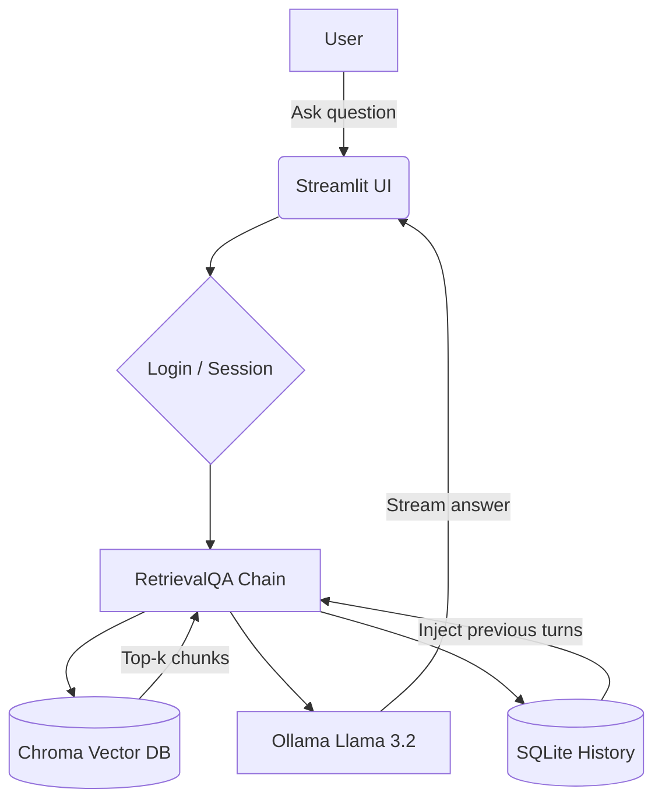

---

```markdown
# 🧠 CodeSarthi – AI Codebase Assistant

[](https://www.python.org/downloads/)
[](https://python.langchain.com/)
[](https://streamlit.io/)
[](https://ollama.com/)
[](https://opensource.org/licenses/MIT)

**A private, local, and intelligent assistant for your codebase.**  
Ask natural language questions about your code, documentation, and PDFs – and get accurate, context‑aware answers with conversation memory.

---

## ✨ What is CodeSarthi?

CodeSarthi is an AI‑powered tool that ingests your entire code repository – including source files, READMEs, markdown docs, and PDFs – and lets you query it in plain English.  
It uses a local Large Language Model (Llama 3.2 via Ollama) for complete privacy, **no cloud API costs**, and runs entirely on your machine.

Whether you’re a new developer trying to understand a large project, or a senior dev who needs quick answers without digging through files, CodeSarthi is your instant code companion.

---

## 🚀 Key Features

- 🔐 **Multi‑user login** – Isolated conversations per user (SQLite authentication)
- 📚 **Full codebase ingestion** – Supports `.py`, `.md`, `.pdf`, and more (extensible)
- 🧠 **Semantic search** – Uses embeddings and a vector database (Chroma) to find the most relevant code/documentation chunks
- 💬 **Conversational memory** – Remembers the context of your conversation across multiple turns
- ⚡ **Streaming responses** – Real‑time word‑by‑word output, just like ChatGPT
- 🔍 **Observability** – Optional integration with LangSmith to trace every step
- 🛡️ **100% local** – Your code never leaves your machine; no internet required after setup

---

## 🧱 How It Works



1. **Ingestion (one‑time):** All files in `repo/` and `data/` are split into chunks, embedded with Ollama, and stored in a local Chroma database.
2. **Query:** Your question is embedded and used to find the most relevant chunks via similarity search.
3. **Augmentation:** Those chunks are injected into a prompt together with the conversation history.
4. **Generation:** The LLM (Llama 3.2) streams the answer back to the UI.
5. **Memory:** Every exchange is saved to SQLite and reused in future interactions.

---

## 🛠️ Tech Stack

- **LangChain** – Orchestration, RAG, memory, and chains
- **Ollama** – Local LLM (Llama 3.2) and embeddings
- **ChromaDB** – Vector database for similarity search
- **Streamlit** – Interactive web UI
- **SQLite** – User accounts and chat history persistence
- **PyPDF / Unstructured** – Document parsing
- **LangSmith** – Optional observability

---

## 📋 Prerequisites

Before you begin, make sure you have:

- Python 3.10 or higher
- [Ollama](https://ollama.com/) installed and running in the background
- Git (optional, for cloning)

---

## 🔧 Installation & Setup

### 1. Clone the repository
```bash
git clone https://github.com/your-username/codesarthi.git
cd codesarthi
```

### 2. Create a virtual environment
```bash
python -m venv venv
source venv/bin/activate      # On Linux/Mac
venv\Scripts\activate         # On Windows
```

### 3. Install dependencies
```bash
pip install -r requirements.txt
```

### 4. Pull the local LLM
Make sure Ollama is running (`ollama serve` in another terminal). Then:
```bash
ollama pull llama3.2
```

### 5. (Optional) Set up LangSmith tracing
Create a `.env` file from the example:
```
LANGCHAIN_TRACING_V2=true
LANGCHAIN_ENDPOINT=https://api.smith.langchain.com
LANGCHAIN_API_KEY=ls__your_key_here
LANGCHAIN_PROJECT=codesarthi
```
You can skip this – the app will still work without it.

### 6. Prepare your codebase
Place your source files, READMEs, and PDFs in the `repo/` folder.  
The sample project already contains a few files for testing.

### 7. Ingest the data
This step creates the vector database (takes a few minutes on first run):
```bash
python ingest.py
```
You should see messages like `Loaded X pages`, `Created Y chunks`, `Vector store created`.

### 8. Run the assistant
```bash
streamlit run app.py
```
Open your browser at http://localhost:8501.

---

## 🧪 Sample Queries

Once the app is running, you can ask questions like:

- “How does the authentication flow work?”
- “What is the purpose of `user_service.py`?”
- “Explain the password hashing function.”
- “List the coding standards from the PDF.”
- “What does the function `hash_password` do?”

The assistant will answer using the content from your repository.

---

## 📁 Project Structure

```
codesarthi/
├── .env                     # Environment variables (LangSmith keys)
├── .gitignore               # Ignore venv, chroma_code, .env, etc.
├── requirements.txt         # Python dependencies
├── README.md                # This file
├── auth_db.py               # User authentication with SQLite
├── ingest.py                # Document loader, chunking, embedding, vector store
├── app.py                   # Streamlit UI (login, chat, streaming, reset)
├── repo/                    # Your codebase files (add yours here)
│   ├── README.md
│   ├── auth.py
│   └── user_service.py
├── data/                    # Additional PDFs (optional)
│   └── sample.pdf
├── chroma_code/             # Vector database (created by ingest.py – gitignored)
└── users.db                 # SQLite user database (created at runtime – gitignored)
```

---

## 🤝 Contributing

Contributions are welcome! If you have ideas for new features or improvements:

1. Fork the repository
2. Create a new branch (`git checkout -b feature/amazing-feature`)
3. Commit your changes (`git commit -m 'Add some amazing feature'`)
4. Push to the branch (`git push origin feature/amazing-feature`)
5. Open a Pull Request

---

## 📝 License

This project is licensed under the MIT License – see the [LICENSE](LICENSE) file for details.

---

## 🙏 Acknowledgements

- Built with [LangChain](https://python.langchain.com/)
- Powered by [Ollama](https://ollama.com/) and [Llama 3.2](https://ollama.com/library/llama3.2)
- UI by [Streamlit](https://streamlit.io/)
- Vector database by [Chroma](https://www.trychroma.com/)

---

**Happy coding!** 🚀
```